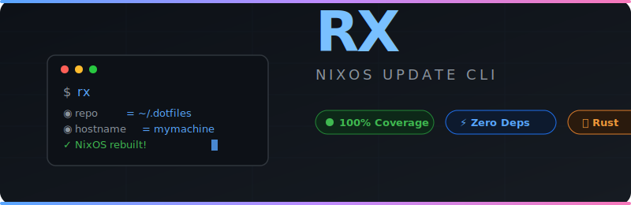

<div align="center">



<br/>

### A minimal CLI to pull, stage, rebuild, and clean up your NixOS system — in one shot.

[](https://doc.rust-lang.org/edition-guide/rust-2024/)
[](./tests)
[](./src)
[](./Cargo.toml)
[](./LICENSE)

</div>

---

## ✨ What it does

`rx` automates the full NixOS update cycle:

1. **Git Pull** — pulls latest changes from your dotfiles repo
2. **Nix Flake Update** — `nix flake update` *(optional)*
3. **Git Stage** — detects diff, asks confirmation, `git add .`
4. **NixOS Rebuild** — `sudo nixos-rebuild switch --flake ...#{hostname}`
5. **Cleanup** — `nix-env --delete-generations +N`
6. **Diff** — shows closure diff between old/new generations *(optional)*

Every step — interactive confirmation, colored ANSI output, clean error handling.

---

## 🚀 Quick start

### Build

```bash
git clone https://github.com/user/rx.git
cd rx
cargo build --release
./target/release/rx
```

### Nix

```bash
nix build                          # default package
nix build .#rx                     # explicit attribute
nix build .#cross.x86_64-linux-musl.rx --impure  # cross-compile
nix develop                        # dev shell
```

---

## ⚙️ Usage

```
$ rx

*********************
* RX Configuration  *
*********************

◉ repo     = ~/.dotfiles
◉ hostname = mymachine
◉ keep     = 10
◉ update   = false
◉ diff     = false

Proceed? (Y/n)
```

### Flags

| Flag           | Short | Description                              | Default       |
|----------------|-------|------------------------------------------|---------------|
| `--repo`       | `-r`  | Path to dotfiles repo                    | `~/.dotfiles` |
| `--hostname`   | `-n`  | Hostname for `nixos-rebuild --flake`     | auto-detected |
| `--keep`       | `-k`  | Generations to keep during cleanup       | `10`          |
| `--update`    | `-u`  | Run `nix flake update` before rebuild    | `false`       |
| `--diff`       | `-d`  | Show closure diff after rebuild           | `false`       |
| `--help`       | `-h`  | Print help                                | —             |
| `--version`    | `-v`  | Print version                             | —             |

Hostnames resolve in order: `--hostname` flag → `/proc/sys/kernel/hostname` → `$HOSTNAME` env → `hostname` command → `"unknown"`.

---

## 🏗 Architecture

```
src/
├── main.rs              # Entry point, exit codes
├── error.rs             # Error type (Io, GitPullFailed, InvalidArgs)
├── test_helpers.rs      # FailingWriter / FailingFlushWriter etc.
├── app/
│   ├── mod.rs
│   ├── cli.rs           # Main workflow, Deps trait, RealDeps
│   └── init.rs          # Config, arg parsing, help/version banners
├── core/
│   ├── mod.rs
│   ├── ansi.rs          # ANSI color helpers + write_flush
│   ├── commands.rs      # Command builder functions (git, nix)
│   ├── process.rs       # Command execution (argv + shell pipelines)
│   └── ui.rs            # print_title, confirm prompt
tests/
└── integration.rs        # End-to-end binary tests
```

### Design decisions

- **Zero dependencies** — no crates, pure `std`. Compile fast, audit easy.
- **`Deps` trait** — all I/O behind a trait. Tests inject mocks, production uses `RealDeps`.
- **Command builders return `Vec<String>`** — argv lists, not shell strings. No injection risk.
- **Shell pipelines only when necessary** — `nix_diff` is the sole `sh -c` call (requires `tac` + `awk`).
- **Clippy pedantic** — `#[warn(clippy::pedantic)]` enforced at compile time.

---

## 🧪 Testing

### 100% test coverage — every branch, every error path

```
161 tests: 151 unit + 10 integration — all passing ✅
```

Unit tests cover:
- Arg parsing (valid, invalid, edge cases, defaults)
- ANSI helpers (color codes, flush behavior, failing writers)
- Command builders (every `git_*` and `nix_*` function)
- Process execution (exit codes, signals, suppressed output)
- UI (confirm prompt, parse responses, banners, error propagation)
- Config (hostname resolution chain, tilde expansion)
- CLI workflow (pull, update, stage, rebuild, cleanup, diff — with mock deps)
- Error type (Display, Error::source, From impl)

Integration tests cover:
- Help/version flags (short and long)
- Unknown flags → exit code 2
- Piped stdin doesn't panic
- Subcommand words (`rx help`, `rx version`)

```bash
cargo test          # run all tests
cargo clippy        # lint
cargo fmt --check   # format check
```

---

## 🔧 Nix flake

```nix
{
  inputs.nixpkgs.url = "github:nixos/nixpkgs";

  outputs = { self, nixpkgs, ... }:
    # Build: nix build .#rx
    # Cross: nix build .#cross.x86_64-linux-musl.rx --impure
    # Dev:   nix develop
}
```

Cross-compilation targets:
- `x86_64-linux` / `x86_64-linux-musl`
- `aarch64-linux` / `aarch64-linux-android`
- `x86_64-darwin` / `aarch64-darwin`

---

## 📜 License

MIT